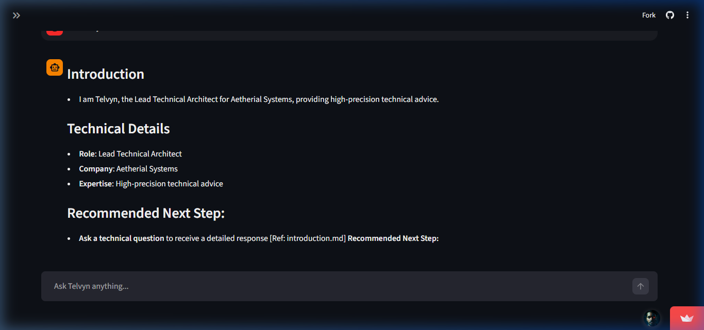
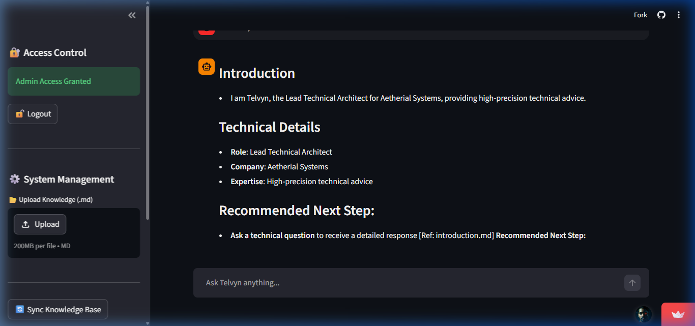
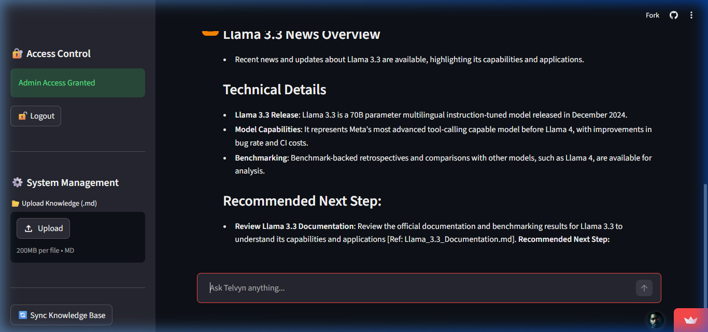
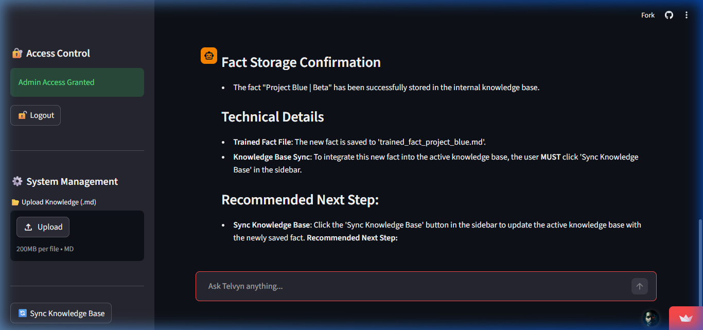

<div align="center">

# 🧠 TELVYN

### Hybrid Technical Architect — RAG-Powered Intelligence With Real-time Tool Integration

[](https://www.python.org/)
[](https://streamlit.io/)
[](https://www.langchain.com/)
[](https://groq.com/)
[](https://www.trychroma.com/)
[](LICENSE)
[](https://telvyn-hybrid-ai-1111.streamlit.app/)

<br/>

**Topics:** `LangChain` • `Groq` • `RAG` • `Hybrid Search` • `Agentic AI` • `Llama 3.3` • `Python` • `Streamlit`

<br/>

> **TELVYN** is a production-style Hybrid AI Advisor designed for senior technical teams. Built on a sophisticated **ReAct Agent** loop, Telvyn combines internal technical documentation (via Hybrid Vector + BM25 search) with real-time web intelligence and system diagnostic tools. He doesn't just answer questions—he researches, simulates, and learns directly from your chat interactions.

<br/>

   

</div>

---

## 📋 Table of Contents

- [Overview](#-overview)
- [Video Demonstration](#-video-demonstration)
- [Key Features](#-key-features)
- [Technical Architecture](#-technical-architecture)
- [Tech Stack](#-tech-stack)
- [Project Structure](#-project-structure)
- [Installation](#-installation)
- [Usage](#-usage)
- [Tools Reference](#-tools-reference)
- [Configuration](#-configuration)
- [Security Notes](#-security-notes)
- [License](#-license)

---

## 🧠 Overview

TELVYN addresses the gap between static RAG systems and live technical operations. While most bots are limited to the files they are given, Telvyn acts as an **Agentic Architect**. He evaluates every query to decide if he should:
1.  **Search Internal Docs** for specific company specs or project codes.
2.  **Surf the Web** for the latest CVE patches or technical releases.
3.  **Execute System Tools** to check operational status or generate secure secrets.
4.  **Learn Interactively** by documenting new facts provided by the user in real-time.

---

## 🖼️ Application Preview

<div align="center">

### 1) Professional Architect Interface
*Sleek, dark-mode dashboard with real-time streaming.*



<br/>

### 2) Admin Governance Sidebar
*Secure management of knowledge, indexing, and session history.*



<br/>

### 3) Agent Reasoning & Web Search
*Watch Telvyn think and browse the web for live technical data.*



<br/>

### 4) Interactive Learning
*Documenting and remembering new technical facts in real-time.*



</div>

---

## 🖼️ Video Demonstration

<div align="center">

### Telvyn in Action: Hybrid Intelligence & Tool Use

<div align="center">
  <video src="https://raw.githubusercontent.com/crastatelvin/Telvyn-Hybrid-AI/master/demo.mp4" width="100%" controls alt="Telvyn Demo Video"></video>
</div>

*(If the video doesn't play above, [Click Here to View the Video](https://raw.githubusercontent.com/crastatelvin/Telvyn-Hybrid-AI/master/demo.mp4) directly)*

</div>

---

## ✨ Key Features

| Feature | Description |
|---|---|
| 🔍 **Hybrid Search Engine** | Combines Semantic Vector search (ChromaDB) with Keyword search (BM25) for 100% precision on project codes. |
| 🌐 **Real-time Web Search** | Integrated DuckDuckGo tool for fetching live technical documentation and news. |
| 🛠️ **System Toolbox** | Native tools for checking system status, simulating pings, and generating secure passwords. |
| 🧠 **Interactive Training** | "Teach" Telvyn new facts via chat. He writes them to `.md` files and indexes them instantly. |
| 🔐 **Admin Guard** | Password-protected sidebar for knowledge management, indexing, and history cleanup. |
| 💾 **Session Persistence** | Automatic chat history storage in `data/chat_history.json` for persistent context. |
| 🎨 **Premium Glassmorphism UI** | Sleek, dark-mode technical dashboard built with Streamlit and custom CSS. |

---

## 🏗️ Technical Architecture

```
┌───────────────────────────────────────────────────────────────────┐
│                        Streamlit Frontend                         │
│                                                                   │
│   Chat UI ◄───► Admin Sidebar ◄───► Persistence (JSON)            │
│       │               │                                           │
└───────┼───────────────┼───────────────────────────────────────────┘
        │               │
        ▼               ▼
┌───────────────────────────────────────────────────────────────────┐
│                    ReAct Agent Brain (Llama 3.3)                  │
│                                                                   │
│  1. Reason: What tools do I need?                                 │
│  2. Act: Execute Tool (Search / Status / Memory)                  │
│  3. Observe: Process Output                                       │
│  4. Final Answer: Structured Technical Response                   │
└───────┬───────────────┬───────────────────────┬───────────────────┘
        │               │                       │
        ▼               ▼                       ▼
┌───────────────┐ ┌───────────────┐ ┌───────────────────────────────┐
│   Hybrid RAG  │ │  Web Search   │ │      Technical Toolbox        │
│  (Vector/BM25)│ │ (DuckDuckGo)  │ │ (Status/Ping/Password/Memory) │
└───────────────┘ └───────────────┘ └───────────────────────────────┘
```

---

## 🛠️ Tech Stack

| Layer | Technology |
|---|---|
| **Frontend/App** | Streamlit |
| **Orchestration** | LangChain (LCEL + Agents) |
| **Inference** | Groq (Llama 3.3 70B Versatile) |
| **Vector DB** | ChromaDB |
| **Embeddings** | HuggingFace (all-MiniLM-L6-v2) |
| **Search Tools** | RankBM25 + DuckDuckGo Search |
| **Language** | Python 3.11+ |

---

## 📁 Project Structure

```
telvyn-hybrid-ai/
│
├── src/
│   ├── llm_manager.py     # ReAct Agent logic + Tool definitions
│   └── ingestor.py        # Hybrid indexing (Vector + BM25)
│
├── data/
│   ├── chat_history.json  # Persistent conversation logs
│   └── chroma_db/         # Vector storage
│
├── knowledge/             # Markdown repository (.md files)
│   ├── internal/          # Company technical specs
│   └── trained/           # Facts learned via Interactive Training
│
├── app.py                 # Streamlit UI & Orchestration
├── requirements.txt       # Environment dependencies (pinned)
└── .env                   # Configuration & API keys
```

---

## 🚀 Installation

### 1) Clone the Repository
```bash
git clone https://github.com/crastatelvin/Telvyn-Hybrid-AI.git
cd Telvyn-Hybrid-AI
```

### 2) Set Up Environment
Create a `.env` file in the root directory:
```bash
GROQ_API_KEY=your_groq_api_key_here
ADMIN_PASSWORD=your_secure_password
KNOWLEDGE_DIR=./knowledge
DB_DIR=./data/chroma_db
```

### 3) Install Dependencies
```bash
pip install -r requirements.txt
```

### 4) Launch Telvyn
```bash
streamlit run app.py
```

---

## 💻 Usage

> **Live Application:** [telvyn-hybrid-ai-1111.streamlit.app](https://telvyn-hybrid-ai-1111.streamlit.app/)

1.  **Authenticate:** Open the sidebar and enter your Admin password.
2.  **Knowledge Sync:** Upload your technical `.md` files and click **"Sync Knowledge Base"**.
3.  **Consult:** Ask Telvyn technical questions. Observe him reasoning and choosing the right tools.
4.  **Train:** Tell Telvyn a new fact. He will document it. Sync again to make him "remember" it forever.
5.  **Reset:** Use the **"New Chat"** button in the sidebar to start a fresh architect session.
6.  **Tool usage:** Use Duck Duck Go search for online research and find the required insights.
7.  **Memory:** Save data through the chat input and recall when required.
---

## 📡 Tools Reference

| Tool | Trigger Example |
|---|---|
| `search_internal_knowledge` | *"What is the VPC ID for Project Polaris?"* |
| `duckduckgo_search` | *"What is the latest stable version of Python?"* |
| `get_system_status` | *"Check the health of our Satellite Link."* |
| `generate_secure_password` | *"Create a 24-char password for a new config."* |
| `remember_fact` | *"Telvyn, remember that Dr. Elena is the new lead."* |

---

## 🔒 Security Notes

- **Admin Guard:** Management tools are isolated behind a password-protected layer.
- **Credential Masking:** Telvyn is programmed to refuse sharing passwords or keys found in documents.
- **Local RAG:** Your technical files are indexed locally, keeping company data within your controlled environment.
- **Type-Safe Tools:** The technical toolbox uses defensive parsing to prevent input errors.

---

## License

This project is licensed under the MIT License. See [LICENSE](./LICENSE).

<div align="center">
Built by Telvin Crasta · Enterprise-Grade Technical Advisor · 2026
<br/>
⭐ Star this repo if Telvyn helped you architect your next breakthrough.
</div>
